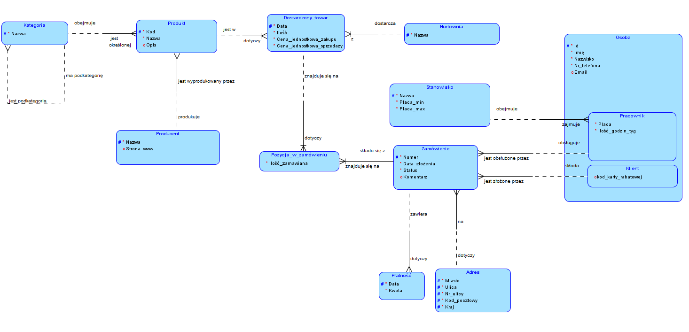
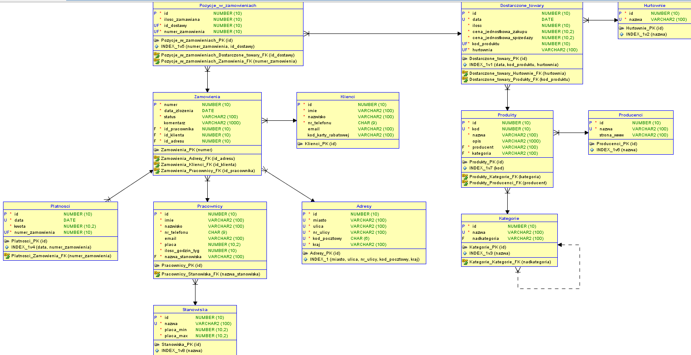

# ShopManager

## Table of contents
* [General info](#general-info)
* [Quick installation](#quick-installation)
* [Database diagrams](#database-diagrams)
* [Technologies](#technologies)

## General info
The application is used to manage the store. Application was created for <code>legacy database</code> shown on the diagrams. This software enables the storage of information about products, their stock in the warehouse, orders from customers, information about customers, employees and wholesalers from which the store orders the goods. The user who uses the application is able to define, view and edit this data. For example, it can enter information about new orders, products, and also change, for example, employee wages.

## Quick installation
1. Create a database <code>MariaDB</code>.
> mysql -u root -p

> create database shopmanager_db4;

> exit

2. Create tables with [ddl script](https://github.com/Endrju00/Projekt-ZBD/blob/main/diagrams/relationship_diagram/relacja.ddl).
> cd diagrams/relationship_diagram

> mysql -u root -p shopmanager_db4 < relacja.ddl
3. Create function and procedure from [additional.sql](https://github.com/Endrju00/Projekt-ZBD/blob/main/diagrams/relationship_diagram/additional.sql).
> mysql -u root -p shopmanager_db4 < additional.sql
4. Create virtual environment and install prerequisites.
> cd ../../

>conda create --name zbd python=3.7

> conda activate zbd

> pip install -r requirements.txt
4. Run project.
> cd project 

> python manage.py runserver

## Database diagrams

### Entity diagram

### Relationship diagram

## Technologies
* Python
* Django
* MariaDB
* Bootstrap
* HTML5
* CSS3
