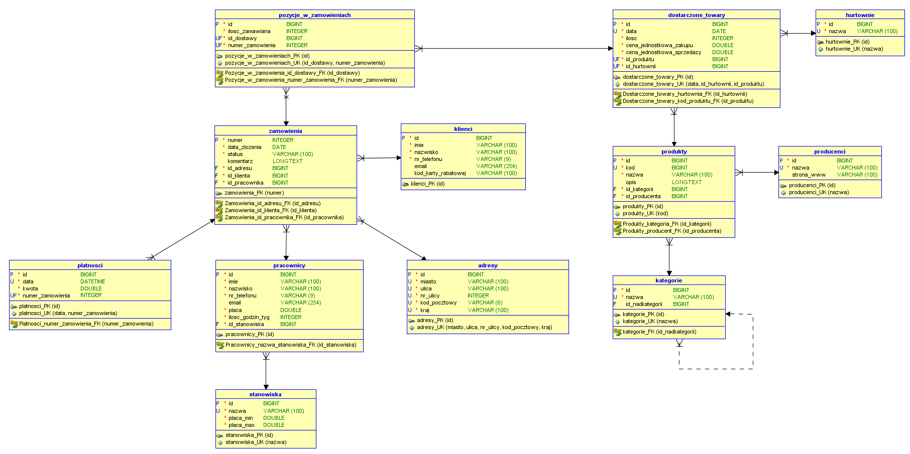

# ShopManager

## Table of contents
* [General info](#general-info)
* [Database diagrams](#database-diagrams)
* [Technologies](#technologies)

## General info
The application is used to manage the store. This system will enable the storage of information about products, their stock in the warehouse, orders from customers, information about customers, employees and wholesalers from which the store orders the goods. The user who uses the application will be able to define, view and edit this data. For example, it can enter information about new orders, products, and also change, for example, employee wages.

## Database diagrams

### Entity diagram

### Relationship diagram

## Technologies
* Python
* Django
* HTML5
* CSS3
